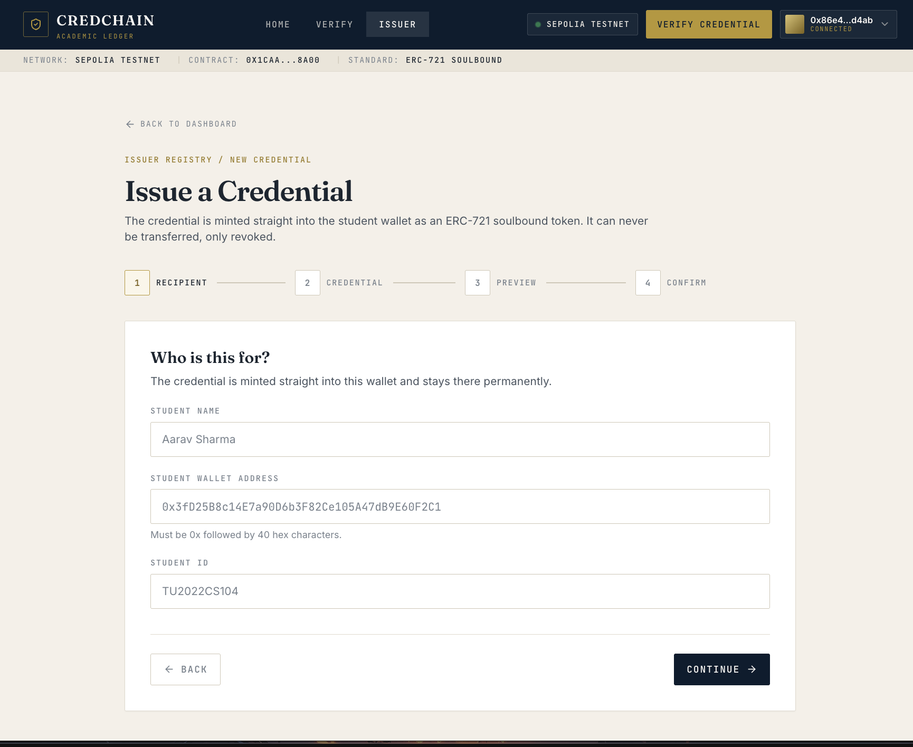
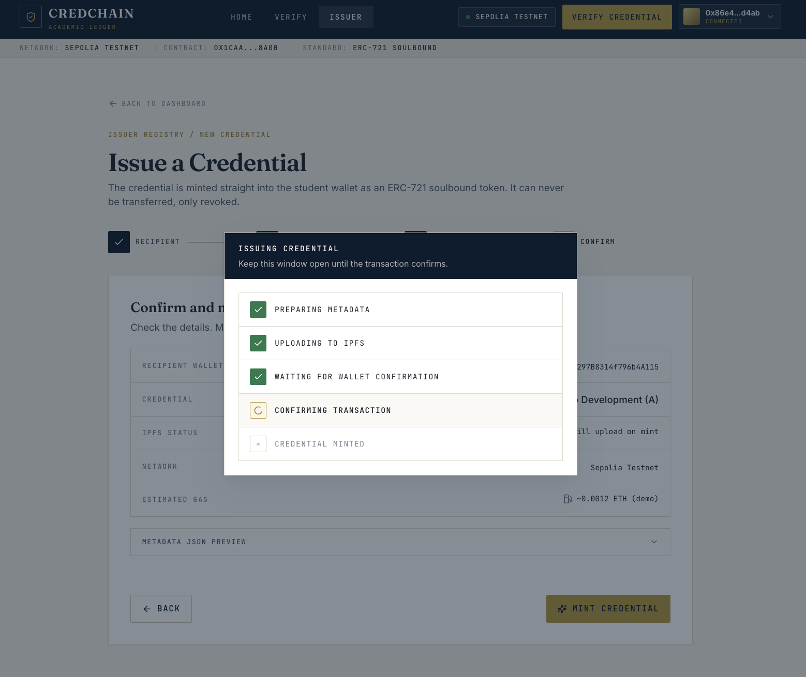
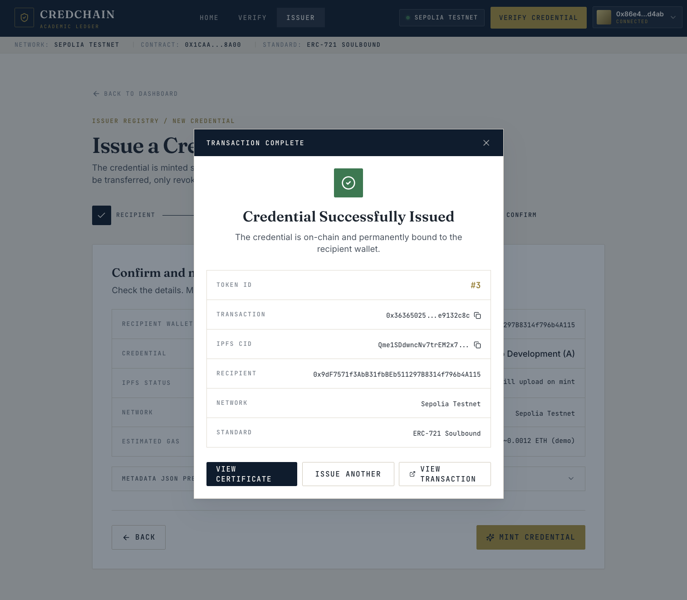

# CredChain

**Credentials you can verify. Trust you can prove.**

CredChain lets universities and institutions issue academic certificates as
non-transferable NFTs on Ethereum. An admin whitelists an institution wallet,
that institution mints a certificate straight into a student's wallet, and the
certificate details are pinned to IPFS. The token is soulbound, so it can never
be sold, lent or moved to another wallet. Anyone can then verify a credential in
seconds from a credential ID, a wallet address or the QR code printed on the
certificate, with no wallet, no account and no email to a registrar office. If a
credential was issued in error, the institution that issued it can revoke it,
and every verification from that moment shows it as revoked.

Built for **HackBlox 2026**, Web3 track, Problem Statement 2: On-Chain
Verifiable Credentials.

---

## Live demo

**Live demo:** [https://credchain-henna.vercel.app](https://credchain-henna.vercel.app)

**Smart contract on Sepolia testnet, source code verified:**

[`0x1caa218252664041DD4bDC876acc7588f0828a00`](https://sepolia.etherscan.io/address/0x1caa218252664041DD4bDC876acc7588f0828a00#code)

Two credentials already exist on-chain, so judges can verify without a wallet:

| Credential | State | Try it |
|---|---|---|
| `#1` | Valid | `/verify/1` |
| `#2` | Revoked | `/verify/2` |

Both were minted with a real `ipfs://` token URI pinned through Pinata.

---

## Screenshots

| Landing page | Verify result |
|---|---|
|  |  |

| Revoked credential | Issuer dashboard |
|---|---|
|  |  |

| Issue credential form | Minting transaction |
|---|---|
|  |  |

| Minting success with real IPFS CID |
|---|
|  |

---

## Features

### Core, all working on Sepolia

- **Issuer whitelist.** The contract admin adds an institution wallet to an
  on-chain whitelist. Any wallet not on the list is rejected by the contract, so
  nobody can mint a credential in a university's name. There is an admin-only
  panel on the issuer dashboard to do this from the browser.
- **Soulbound minting.** A whitelisted issuer mints a credential directly into
  the student's wallet. Token IDs start at 1.
- **Non-transferable by design.** All transfers are blocked in the contract, not
  just hidden in the UI. The token stays in the wallet it was minted to forever.
- **IPFS metadata.** Student name, course, grade, institution and date are pinned
  to IPFS through Pinata. The token stores the content hash, so changing one
  character of the certificate would change the hash and break the link.
- **Public verification, no wallet needed.** Verify by credential ID or by wallet
  address. Reads go through a public RPC endpoint, so a recruiter with no wallet
  and no account can check a credential.
- **Revocation.** The issuing institution, or the admin, can revoke a credential.
  It stays in the student's wallet but every verification then shows it as
  revoked, with the reason shown in red.
- **QR verification.** Every certificate carries a QR code pointing at
  `/verify/<tokenId>` on the live site. The verify page also offers a
  downloadable QR as a PNG.
- **Demo mode.** Setting `VITE_DEMO_MODE=true` swaps the whole data layer to
  seeded mock data and shows a role switcher, so the product can be demonstrated
  with no chain, no wallet and no network.

### Contract level, proven by tests

- Admin-only issuer management, with the zero address rejected.
- Only whitelisted wallets can mint. Removing an issuer stops them immediately.
- Transfers blocked even after the token owner grants an approval.
- Double revocation rejected, and one issuer cannot revoke another's credential.
- 35 passing tests. See [Running the tests](#running-the-tests).

### Not in this build

Honest scope note for judges. These were planned but not built in the time
available, and nothing in the app pretends otherwise:

- Student dashboard at `/student` and a per-certificate detail page.
- A standalone issuer certificates page with sorting. The issuer dashboard does
  include a registry table with filters and search.
- The issuer hierarchy view, and a QR scanning tab on the verify page.
- The revoke confirmation is a simple dialog. The richer version with a required
  reason dropdown was planned for a later phase.

---

## Architecture

Three pieces, no backend server and no database.

### 1. The smart contract

`backend/contracts/SoulboundCertificate.sol`, Solidity 0.8.24, built on
OpenZeppelin v5. It is an `ERC721Enumerable` with `Ownable`.

It stores a `Certificate` record per token: the issuer address, the IPFS token
URI, the issue timestamp and a revoked flag. It exposes `verifyCertificate` as a
public view function returning everything a verifier needs in one call, and
`getCertificatesOf` so a whole wallet can be looked up at once.

### 2. The frontend

`frontend/`, a Vite + React single page app with Tailwind. It talks to the chain
directly with ethers v6. There is no server in between.

Every piece of data access goes through one file,
`frontend/src/services/credentialService.js`. That file is a switch: it re-exports
either `chainService.js` (real ethers calls) or `mockService.js` (seeded demo
data), chosen by `VITE_DEMO_MODE`. Both expose exactly the same function names
and return the same shapes, so no page or component knows or cares which one is
running. That is what made it possible to build and demo the whole product before
the contract was connected.

Reads use a plain JSON-RPC provider, so the verify page works with no wallet at
all. Writes use MetaMask through `BrowserProvider`.

### 3. IPFS

`frontend/src/services/ipfs.js` pins the metadata JSON to Pinata with
`pinJSONToIPFS` and stores the returned `ipfs://<CID>` on the token. Reading back
tries the Pinata gateway first, then `ipfs.io`. If no Pinata key is configured,
it falls back to a `data:application/json;base64,...` URI so the app still works
end to end on a local chain, and the interface says plainly that the metadata is
stored inline rather than on IPFS.

### Flow

```
Admin wallet          Issuer wallet             Student wallet      Anyone
     |                      |                          |               |
 addIssuer(issuer)          |                          |               |
     |------------------->  |                          |               |
     |               pin metadata to IPFS              |               |
     |                      |                          |               |
     |               mintCertificate(student, ipfs://CID)              |
     |                      |------------------------> |               |
     |                      |                     token #1             |
     |                      |                     (cannot move)        |
     |                      |                          |               |
     |               revokeCertificate(1)               |               |
     |                      |                          |               |
     |                      |          verifyCertificate(1) <----------|
     |                      |                          |     no wallet needed
```

---

## Security notes

- **`onlyOwner` on issuer management.** `addIssuer` and `removeIssuer` are
  guarded by OpenZeppelin's `Ownable`. A non-owner calling them reverts with
  `OwnableUnauthorizedAccount`. `addIssuer` also rejects the zero address.
- **`onlyIssuer` on minting.** `mintCertificate` is guarded by a custom modifier
  that checks the `isIssuer` mapping and reverts with
  `"Not an authorized issuer"`. Being the contract owner is not enough on its
  own: the owner must whitelist itself to mint. This is covered by a test.
- **Transfers blocked in `_update`.** Soulbound behaviour is enforced at the
  lowest level. `_update` is overridden and requires that either `from` or `to`
  is the zero address, which permits minting and burning but rejects every
  wallet-to-wallet move with `"Soulbound: transfer not allowed"`. Because this
  sits in `_update`, it blocks `transferFrom`, `safeTransferFrom` and any
  approved-operator transfer alike. There is no UI-only trick here.
- **Revoke permissions.** `revokeCertificate` requires the caller to be either
  the wallet that issued that specific certificate or the contract owner. Anyone
  else, including the student who holds the token, is rejected with
  `"Not authorized to revoke"`. A second revoke of the same token reverts with
  `"Already revoked"`, and revoking a token that does not exist reverts with
  `"Nonexistent token"`.
- **Revoke does not confiscate.** A revoked credential stays in the student's
  wallet. It is marked invalid rather than seized or burned.
- **Verification is public and read-only.** `verifyCertificate` is a view
  function callable by anyone, which is why the verify page needs no wallet.
- **Tests.** 35 tests cover deployment, the whitelist, minting permissions, the
  soulbound guarantee including the approval bypass attempt, revocation
  permissions and the multi-issuer case.

### Known limitations, stated openly

- The Pinata JWT lives in the frontend bundle, because a static site cannot hide
  a key. This is acceptable here only because the key is scoped to
  `pinJSONToIPFS` and nothing else. A production build would proxy this through a
  small server.
- The contract has a flat whitelist. There is no on-chain role hierarchy.
- The contract owner is a single wallet. A production deployment should use a
  multisig.

---

## Running it locally

Requires Node 18 or newer. Built and tested on Node 24.

### Backend

```bash
cd backend
npm install
npx hardhat compile
```

Start a local chain in one terminal and leave it running:

```bash
npm run node
```

In a second terminal, deploy to it and copy the ABI and address into the
frontend:

```bash
npm run deploy:local
npm run export-abi
```

The local deploy also whitelists Hardhat account 1 as an issuer, so there is
something to demo straight away. It prints the contract address and the deploy
block.

### Frontend

```bash
cd frontend
npm install
cp .env.example .env
npm run dev
```

Open http://localhost:5173.

For the local chain, `.env` should contain:

```
VITE_DEMO_MODE=false
VITE_CHAIN_ID=31337
VITE_RPC_URL=http://127.0.0.1:8545
VITE_DEPLOY_BLOCK=1
VITE_PINATA_JWT=
VITE_EXPLORER_URL=
```

Leaving `VITE_PINATA_JWT` empty is fine locally: metadata is stored inline
instead, and the app says so.

To run the presentation version with seeded data and no chain at all, set
`VITE_DEMO_MODE=true` and restart.

### MetaMask for the local chain

Add a network manually: name `Hardhat Local`, RPC `http://127.0.0.1:8545`,
chain ID `31337`, currency `ETH`. Then import Hardhat accounts 0 (admin),
1 (issuer) and 2 (student) using the private keys that `npm run node` prints in
its own terminal. Those are public test keys that everyone running Hardhat has.

If a transaction fails with a nonce error after restarting the node, clear
MetaMask's cached activity: Settings, Advanced, Clear activity tab data.

---

## Running the tests

```bash
cd backend
npx hardhat test
```

All 35 pass:

```
  SoulboundCertificate
    Deployment
      ✔ sets the name and symbol
      ✔ makes the deployer the owner
      ✔ starts with no certificates and no issuers
    Issuer whitelist
      ✔ lets the owner add an issuer and emits IssuerAdded
      ✔ lets the owner remove an issuer and emits IssuerRemoved
      ✔ stops a non-owner from adding an issuer
      ✔ stops a non-owner from removing an issuer
      ✔ rejects the zero address as an issuer
    Minting
      ✔ lets a whitelisted issuer mint and emits CertificateMinted
      ✔ starts token IDs at 1 and increments by 1
      ✔ stops a wallet that is not whitelisted from minting
      ✔ stops the owner minting unless the owner is also whitelisted
      ✔ stops a removed issuer from minting again
      ✔ rejects minting to the zero address
      ✔ stores the tokenURI against the token
    Soulbound enforcement
      ✔ blocks transferFrom
      ✔ blocks safeTransferFrom
      ✔ blocks a transfer even after the owner approves someone
      ✔ leaves the certificate with the student after a failed transfer
    Revocation
      ✔ lets the issuing wallet revoke and emits CertificateRevoked
      ✔ lets the contract owner revoke
      ✔ stops anyone else revoking, including the student
      ✔ stops the same certificate being revoked twice
      ✔ rejects revoking a token that does not exist
      ✔ keeps the certificate in the student wallet after revocation
    verifyCertificate
      ✔ returns the full record for a valid certificate
      ✔ reports valid false and revoked true after revocation
      ✔ reverts for a token that does not exist
      ✔ is readable by any wallet, no whitelist needed
    getCertificatesOf
      ✔ returns every token a wallet holds
      ✔ returns an empty list for a wallet with none
      ✔ still lists a revoked certificate, since it stays in the wallet
    tokenURI
      ✔ reverts for a token that does not exist
    Multiple issuers
      ✔ keeps each certificate attributed to the wallet that minted it
      ✔ stops one issuer revoking another issuer's certificate

  35 passing
```

---

## Deploying to Sepolia

Create `backend/.env` from `backend/.env.example` and fill in three values:
`SEPOLIA_RPC_URL` (Alchemy or Infura), `PRIVATE_KEY` (a throwaway test wallet
only) and `ETHERSCAN_API_KEY`. This file is gitignored and must never be
committed.

```bash
cd backend
npm run deploy:sepolia
npx hardhat verify --network sepolia <address> "CredChain Certificate" "CRED"
npm run export-abi
```

Then point `frontend/.env` at Sepolia with `VITE_CHAIN_ID=11155111`, a Sepolia
`VITE_RPC_URL`, the deploy block, your Pinata JWT and
`VITE_EXPLORER_URL=https://sepolia.etherscan.io`.

---

## Tech stack

**Contract:** Solidity 0.8.24, OpenZeppelin v5 (`ERC721Enumerable`, `Ownable`),
Hardhat 2.29, ethers v6, Chai and Mocha for tests. EVM target Cancun.

**Frontend:** Vite 5, React 18, JavaScript, Tailwind CSS 3, React Router 6,
ethers v6, lucide-react for icons, qrcode.react for QR codes.

**Infrastructure:** Sepolia testnet, Pinata for IPFS pinning, Etherscan for
source verification, Vercel for hosting.

**Deliberately not used:** no backend server, no database, no wagmi. Everything
the app knows comes from the contract or from IPFS.

---

## Repository layout

```
credchain/
  README.md
  backend/                          Hardhat project
    contracts/SoulboundCertificate.sol
    test/SoulboundCertificate.test.js      35 tests
    scripts/deploy.js                      deploy, print address and block
    scripts/exportAbi.js                   copy ABI and address to the frontend
    deployments/                           one record per chain
    hardhat.config.js
    .env.example
  frontend/                         Vite + React app
    src/
      components/                   UI, including CertificateCard
      pages/                        Landing, Verify, Issuer dashboard, Issue
      services/
        credentialService.js        the switch, the only file pages import
        chainService.js             real ethers implementation
        mockService.js              demo data implementation
        ipfs.js                     Pinata pin and gateway fetch
      hooks/useWallet.jsx           MetaMask state and events
      utils/                        network config, errors, formatting
      contracts/                    ABI and addresses, written by exportAbi
      data/                         mock data for demo mode
    .env.example
    vercel.json
```

---

## Team

| Name | Role |
|---|---|
| Anushka Vora | Project lead, frontend, Sepolia and Vercel deployment |
| Palak Soni | Smart contract (Solidity, OpenZeppelin, Hardhat tests) |
| Simran Sharma | Contract integration, wallet flow, testing on Sepolia |
| Sanjeevani Panigrahy | IPFS metadata via Pinata, UI design, demo video |

---

Built for HackBlox 2026. All addresses and credentials in this project are on
the Sepolia test network. No real money is involved at any point.
